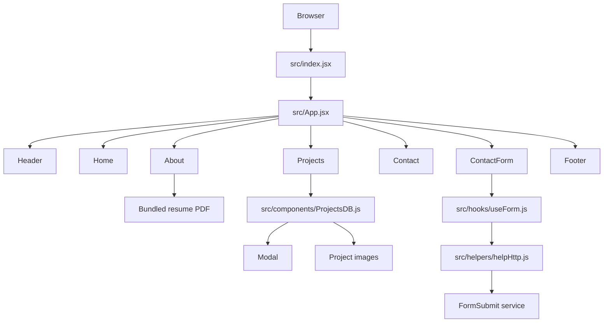

# Portfolio Architecture

## Purpose

This repository contains Felipe Marin's single-page portfolio and downloadable
resume. It presents professional experience, selected projects, contact links,
and a contact form. The production site is hosted on GitHub Pages under the
`/Resume/` path.

## Technology stack

- React 19 for the user interface
- Vite 6 for local development and production builds
- Vitest, Testing Library, and jsdom for automated tests
- Plain CSS for layout, theming, and responsive behaviour
- `file-saver` for downloading the bundled resume
- FormSubmit for contact-form delivery
- GitHub Actions and GitHub Pages for continuous deployment

The site has no application server, database, authentication layer, or runtime
environment variables.

## Runtime structure



`App.jsx` composes the page in display order. Navigation uses in-page fragment
links such as `#about` and `#projects`; there is no client-side router.

## Repository layout

| Path | Responsibility |
| --- | --- |
| `src/index.jsx` | Creates the React root and loads global styles. |
| `src/App.jsx` | Defines the page-level component order. |
| `src/components/` | Contains page sections, the project modal, form UI, and technology icons. |
| `src/components/ProjectsDB.js` | Acts as the source of truth for displayed project metadata. |
| `src/hooks/useForm.js` | Owns contact-form state, validation flow, and submission state. |
| `src/helpers/helpHttp.js` | Wraps `fetch` with JSON defaults and request timeouts. |
| `src/assets/` | Contains local images, video, icons, and the downloadable resume. |
| `src/App.css` | Contains the active component, utility, and responsive styles. |
| `src/index.css` | Contains document-level styles loaded at the application entry point. |
| `src/style.css` | Legacy stylesheet retained for reference; it is not imported. |
| `vite.config.js` | Configures React, Vitest, and the `/Resume/` deployment base path. |
| `.github/workflows/ci.yml` | Tests and builds pull requests, then deploys merged `master` builds. |

## Main application flows

### Portfolio projects

`Projects.jsx` maps over the entries in `ProjectsDB.js`. Selecting a project
stores its identifier, resolves the matching project object, and renders
`Modal.jsx`. The modal displays the project's image, technologies, concepts,
repository link, and optional live-site link.

To add or replace a project:

1. Import an optimized image in `ProjectsDB.js`.
2. Add or update the project object with a unique numeric `id`.
3. Use technology values defined in `TechnoIcons.js`.
4. Provide `link_repository` and, when available, `link_website`.
5. Confirm both the project card and modal at mobile and desktop widths.

### Resume download

`About.jsx` imports the PDF as a Vite asset. The download button passes that
generated asset URL to `file-saver`, preserving the public filename
`Felipe_Marin_Resume.pdf`.

### Background video

`Home.jsx` renders an autoplaying, muted, looping MP4 with `playsInline` for
mobile browsers. Because browsers may still reject autoplay, the component
retries playback after page load and after the visitor's first interaction.

### Contact form

`ContactForm.jsx` performs browser-side validation through `useForm.js`. Valid
submissions are sent directly from the browser to FormSubmit. No secrets should
be added to this flow because all client-side code is publicly visible.

## Styling and responsive design

The active design is primarily maintained in `App.css`. Mobile styles are the
default; larger layouts are introduced at `768px` and `1024px` breakpoints.
Reusable colour and sizing values are CSS custom properties near the top of the
stylesheet.

When changing layout, verify at least:

- A narrow mobile viewport around 375px
- A tablet viewport around 768px
- A desktop viewport at or above 1024px
- Project modal image sizing and scrolling
- Background-video behaviour in Safari and Chromium-based browsers

## Build, test, and deployment

```bash
npm ci
npm run dev
npm test
npm run build
npm run preview
```

Vite writes production output to `dist/`. The `base` setting must remain
`/Resume/` while the site is deployed at `https://pipe-mv.github.io/Resume/`.

The GitHub Actions workflow behaves as follows:

1. Pull requests targeting `master` run tests and a production build.
2. Pushes to `master` repeat verification.
3. A successful post-merge build is packaged and deployed to GitHub Pages.

Do not commit `dist/` or manually update the `gh-pages` branch as part of the
normal deployment process.

## Architectural constraints

- The application is intentionally a static single-page site.
- All shipped assets and client-side values are public.
- Project technology icons depend on the external jsDelivr Devicon CDN.
- Contact delivery depends on the external FormSubmit service.
- Large media files directly affect initial download size and mobile performance.
- GitHub Pages requires repository-relative asset URLs through Vite's base path.

For repository-specific contribution and automation rules, see [AGENTS.md](./AGENTS.md).
